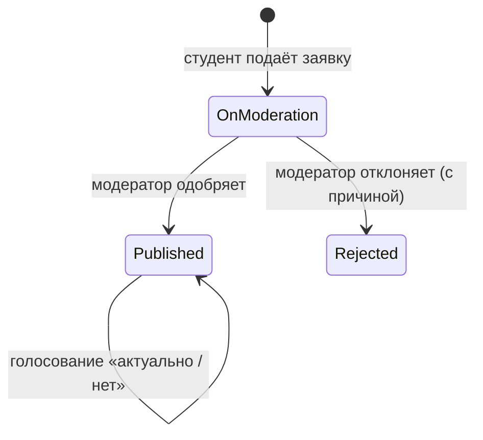

# AggStudentDiscounts — агрегатор студенческих скидок

Backend-сервис каталога **проверенных** студенческих скидок: пользователи предлагают скидки,
модераторы их проверяют, сообщество подтверждает актуальность.

Проект оформлен как **портфолио системного аналитика**: помимо работающего API здесь есть полный
аналитический пакет — требования, бизнес-правила, use cases, диаграммы, словарь данных, ADR и риски.

## Аналитическая документация

| Документ | Содержание |
|---|---|
| [01 · Видение и границы](docs/01-vision-and-scope.md) | Проблема, цели, метрики, стейкхолдеры, scope, допущения, глоссарий |
| [02 · Требования](docs/02-requirements.md) | Бизнес-правила BR-01…10, user stories с критериями приёмки, FR/NFR, матрица трассируемости |
| [03 · Use cases](docs/03-use-cases.md) | Диаграмма вариантов использования, матрица прав, спецификации сценариев, коды ошибок |
| [04 · Диаграммы](docs/04-diagrams.md) | Процесс (BPMN-подобный), состояния заявки, sequence, ER, архитектура (Mermaid) |
| [05 · Данные и API](docs/05-data-dictionary-and-api.md) | Сводка эндпоинтов, словарь данных, примеры запросов |
| [06 · Решения и риски](docs/06-decisions-risks-roadmap.md) | ADR, аудит первой версии, реестр рисков, открытые вопросы, roadmap |
| [OpenAPI](src/AggStudentDiscounts.Api/openapi.yaml) | Контракт API (OpenAPI 3.0) |

## Как работает



- **Гость** — смотрит каталог (поиск, район, радиус, сортировка, пагинация).
- **Студент** — регистрируется, подаёт заявки (до 4 в сутки), следит за статусом, голосует (раз в 15 дней).
- **Модератор** — очередь заявок, одобрение/отклонение, правка данных.

## Технологии

.NET 9 · ASP.NET Core Web API · EF Core + PostgreSQL · JWT (Bearer) · BCrypt · FluentValidation ·
Swagger/OpenAPI · xUnit + WebApplicationFactory · Docker · GitHub Actions

## Быстрый старт (Docker)

```bash
docker compose up --build
```

- API: http://localhost:8080 · Swagger: http://localhost:8080/swagger · Health: `/health`
- Миграции применяются автоматически, создаются демо-данные.
- Демо-учётки (пароль `Demo12345!`, меняется через `SEED_PASSWORD`):
  `moderator@example.com` (роль Moderator), `student@example.com` (роль User).

## Локальный запуск без Docker

Нужны .NET SDK 9 и PostgreSQL. Секреты не хранятся в репозитории:

```bash
cd src/AggStudentDiscounts.Api
dotnet user-secrets set "ConnectionStrings:DefaultConnection" "Host=localhost;Port=5432;Database=aggstudentdiscounts;Username=postgres;Password=<пароль>"
dotnet user-secrets set "Jwt:Key" "<случайная строка от 32 символов>"
dotnet ef database update
dotnet run --launch-profile http   # http://localhost:5075/swagger
```

## Тесты

```bash
dotnet test
```

21 тест: юнит-тесты домена (конечный автомат заявки, пересчёт курса) и интеграционные тесты всего HTTP-пайплайна
(регистрация, JWT, роли, лимиты, жизненный цикл «заявка → модерация → каталог → голосование»).
CI запускает их на каждый push и pull request.

## Структура

```text
docs/                         аналитическая документация
src/AggStudentDiscounts.Api/
  Controllers/                REST-контроллеры
  DTOs/  Validators/          контракты и правила валидации
  Services/                   JWT, сидер демо-данных
  Infrastructure/Persistence/ DbContext
  AggStudentDiscounts.Domain/Entities/   доменные сущности и правила
  Migrations/                 миграции EF Core
tests/AggStudentDiscounts.Tests/         unit + integration
```

## Известные ограничения

- Файлы-подтверждения пока только проверяются по формату и **не сохраняются** (FR-09, см. roadmap).
- Радиусный поиск считается на стороне приложения; для больших каталогов планируется PostGIS (риск R-4).
- Геокодирование описано в OpenAPI как целевое, не реализовано.
