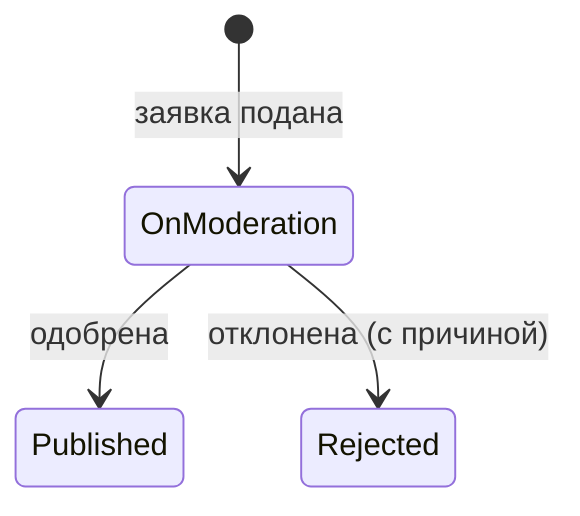

# AggStudentDiscounts

REST API агрегатора студенческих скидок. Пользователи предлагают скидки, модераторы проверяют заявки,
сообщество подтверждает актуальность. Опубликованные скидки доступны всем в каталоге с поиском и фильтрами.

## Возможности

- Регистрация и вход (JWT), роли `User` и `Moderator`
- Каталог заведений: поиск, фильтр по району, поиск по радиусу, сортировка, пагинация
- Автоподсказки адресов и автоматическое дополнение заявки (категория, контакты, режим работы) данными OpenStreetMap с серверным кэшем
- Заявки на добавление скидки с файлами-подтверждениями (JPEG, PNG, HEIC, PDF), личный кабинет, отмена заявки
- Модерация: очередь, одобрение, отклонение с причиной, редактирование
- Голосование за актуальность скидки (один раз в 15 дней)
- Swagger UI, health-check, миграции БД



## Технологии

.NET 9, ASP.NET Core, Entity Framework Core, PostgreSQL, JWT, BCrypt, FluentValidation,
Nominatim (OpenStreetMap), Swagger/OpenAPI, xUnit, Docker, GitHub Actions.

## Запуск через Docker

```bash
docker compose up --build
```

- API: http://localhost:8080, Swagger: http://localhost:8080/swagger, health: `/health`
- Миграции применяются автоматически, создаются демо-данные
- Демо-учётки (пароль `Demo12345!`, задаётся через `SEED_PASSWORD`): `moderator@example.com`, `student@example.com`

## Запуск без Docker

Требуются .NET SDK 9 и PostgreSQL.

```bash
cd src/AggStudentDiscounts.Api
dotnet user-secrets set "ConnectionStrings:DefaultConnection" "Host=localhost;Port=5432;Database=aggstudentdiscounts;Username=postgres;Password=<пароль>"
dotnet user-secrets set "Jwt:Key" "<случайная строка от 32 символов>"
dotnet ef database update
dotnet run --launch-profile http
```

Swagger: http://localhost:5075/swagger

## Тесты

```bash
dotnet test
```

## Конфигурация

| Параметр | Назначение |
|---|---|
| `ConnectionStrings:DefaultConnection` | подключение к PostgreSQL |
| `Jwt:Key` | ключ подписи токенов (≥ 32 символов) |
| `Storage:Path` | каталог для загруженных файлов (включить в резервное копирование) |
| `Geocoding:*` | адрес геосервиса, User-Agent, область поиска, срок кэша |
| `Feedback:TelegramUrl`, `Feedback:Email` | контакты обратной связи |
| `Cors:AllowedOrigins` | разрешённые origin клиента |
| `Security:RequireHttps` | HTTPS-редирект и HSTS |

Параметры задаются через `appsettings`, user-secrets или переменные окружения (`Jwt__Key`).

## Документация

Техническое задание, требования, бизнес-правила, сценарии, диаграммы и API находятся в папке [docs](docs):

- [Техническое задание](docs/technical-specification.md)

1. [Видение и границы проекта](docs/01-vision-and-scope.md)
2. [Требования](docs/02-requirements.md)
3. [Варианты использования](docs/03-use-cases.md)
4. [Диаграммы](docs/04-diagrams.md)
5. [Словарь данных и API](docs/05-data-dictionary-and-api.md)
6. [Решения, риски, roadmap](docs/06-decisions-risks-roadmap.md)
7. [Соответствие реализации ТЗ](docs/07-specification-compliance.md)

Контракт API: [openapi.yaml](src/AggStudentDiscounts.Api/openapi.yaml)

## Структура

```text
docs/                                   документация
src/AggStudentDiscounts.Api/
  Controllers/                          REST-контроллеры
  DTOs/, Validators/                    контракты и валидация
  Services/                             JWT, демо-данные
  Infrastructure/Persistence/           DbContext
  AggStudentDiscounts.Domain/Entities/  доменные сущности
  Migrations/                           миграции EF Core
tests/AggStudentDiscounts.Tests/        unit- и интеграционные тесты
```
