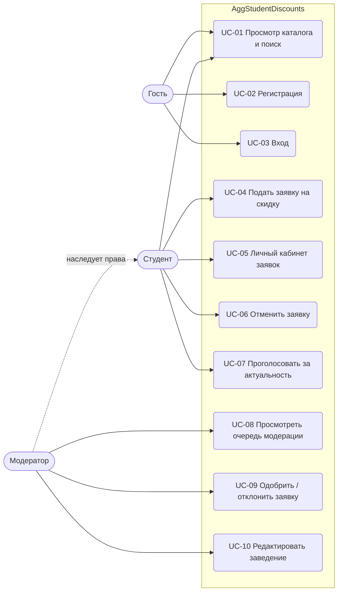

# 3. Варианты использования и ролевая модель

## 3.1 Диаграмма вариантов использования

## 3.2 Матрица прав доступа

| Операция | Гость | Студент | Модератор |
|---|:---:|:---:|:---:|
| Каталог, карточка, статистика голосов | ✅ | ✅ | ✅ |
| Регистрация / вход | ✅ | — | — |
| Профиль (`/auth/me`) | ❌ | ✅ | ✅ |
| Подать заявку | ❌ | ✅ (≤ 4/сутки) | ✅ (без лимита) |
| Свои заявки, отмена | ❌ | ✅ | ✅ |
| Чужая заявка (просмотр) | ❌ | ❌ (403) | ✅ |
| Голосование | ❌ | ✅ (1 раз / 15 дней) | ✅ (без лимита) |
| Очередь модерации, approve/reject, правка | ❌ (401) | ❌ (403) | ✅ |

## 3.3 Спецификации ключевых сценариев

### UC-04. Подать заявку на скидку

| Поле | Содержание |
|---|---|
| Актор | Студент (аутентифицирован) |
| Предусловия | Выполнен вход; не исчерпан лимит 4 заявки/сутки (BR-03) |
| Триггер | Студент нашёл скидку, которой нет в каталоге |
| Основной поток | 1. Студент заполняет название, адрес, описание скидки, условия; опционально — координаты, срок действия, ссылку на источник. 2. Прикладывает ≥ 1 файл-подтверждение. 3. Система валидирует данные (BR-04). 4. Система создаёт заявку со статусом `OnModeration`, привязывает к пользователю из токена. 5. Система возвращает 201 и данные заявки. |
| Альтернативные потоки | **3a.** Не заполнено обязательное поле / недопустимый формат файла / координаты вне диапазона → 400 с перечнем ошибок. **3b.** Лимит исчерпан → 429 «не более 4 в сутки». |
| Постусловия | Заявка видна автору в личном кабинете; в каталог **не** попадает (BR-01) |
| Бизнес-правила | BR-01, BR-03, BR-04 |

### UC-09. Одобрить / отклонить заявку

| Поле | Содержание |
|---|---|
| Актор | Модератор |
| Предусловия | Заявка существует и находится в статусе `OnModeration` |
| Основной поток | 1. Модератор открывает очередь (FIFO). 2. Просматривает данные и вложения. 3. (опц.) Исправляет опечатки, координаты (UC-10). 4a. **Одобрить**: система ставит `Published`, фиксирует `ModeratedAt`; заведение появляется в каталоге. 4b. **Отклонить**: модератор вводит причину; система ставит `Rejected`, сохраняет причину. |
| Альтернативные потоки | **4c.** Заявка уже обработана (другим модератором) → 409. **4d.** Причина не указана → 400 (BR-07). **4e.** Заявка не найдена → 404. |
| Постусловия | Статус финальный и не меняется (BR-08); автор видит результат/причину в кабинете |

### UC-07. Проголосовать за актуальность

| Поле | Содержание |
|---|---|
| Актор | Студент |
| Предусловия | Выполнен вход; заведение опубликовано |
| Основной поток | 1. Студент выбирает «актуально» (`yes`) или «не актуально» (`no`). 2. Система проверяет давность последнего голоса этого пользователя за это заведение. 3. Система сохраняет голос, возвращает обновлённую статистику и `canVoteAgain=false`. |
| Альтернативные потоки | **2a.** С прошлого голоса < 15 дней → 429 (BR-05). **2b.** Значение не `yes`/`no` → 400. **2c.** Заведение не опубликовано/не найдено → 404. **2d.** Нет токена → 401. |
| Исключения | Модератор не ограничен по частоте |

## 3.4 Коды ответов и ошибки (единый контракт)

| Код | Когда | Формат тела |
|---|---|---|
| 400 | Ошибка валидации | `ValidationProblemDetails` (`errors` по полям) |
| 401 | Нет/просрочен/некорректен токен; неверный логин-пароль | `{ "message": "..." }` или пусто |
| 403 | Нет прав на ресурс/действие | пусто |
| 404 | Ресурс не найден или не опубликован | `{ "message": "..." }` |
| 409 | Конфликт состояния (дубль email, повторное решение, отмена обработанной заявки) | `{ "message": "..." }` |
| 429 | Превышен лимит (заявки/сутки, голосование раз в 15 дней) | `{ "message": "..." }` |
