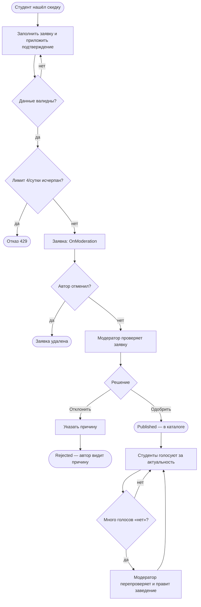
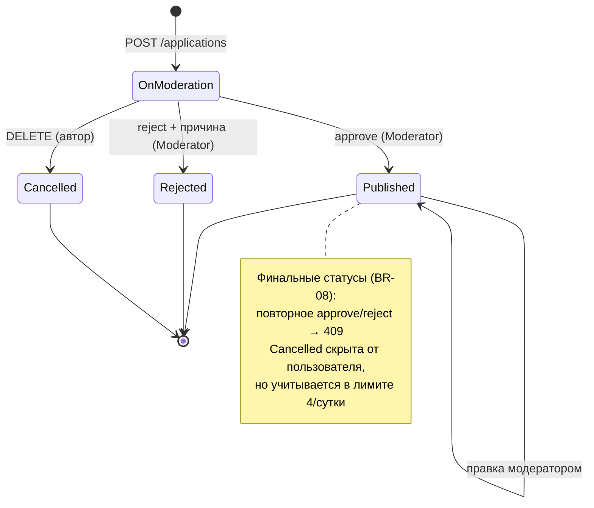
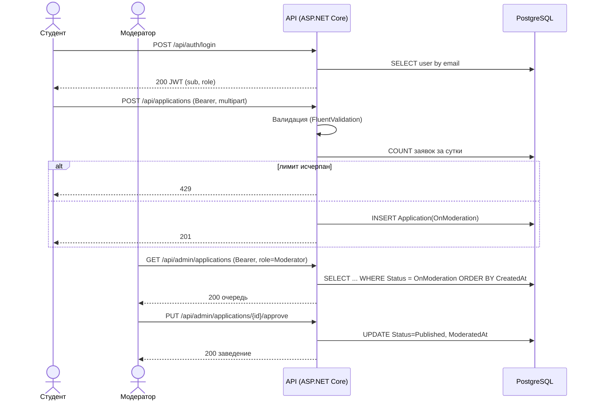
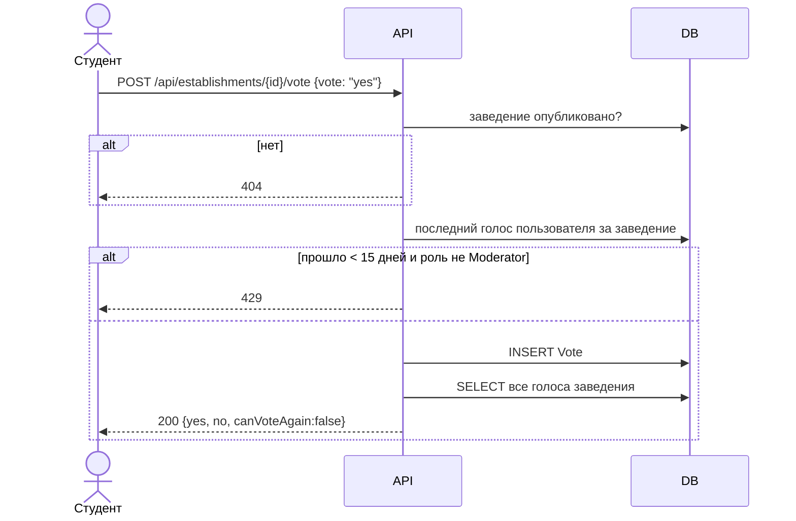
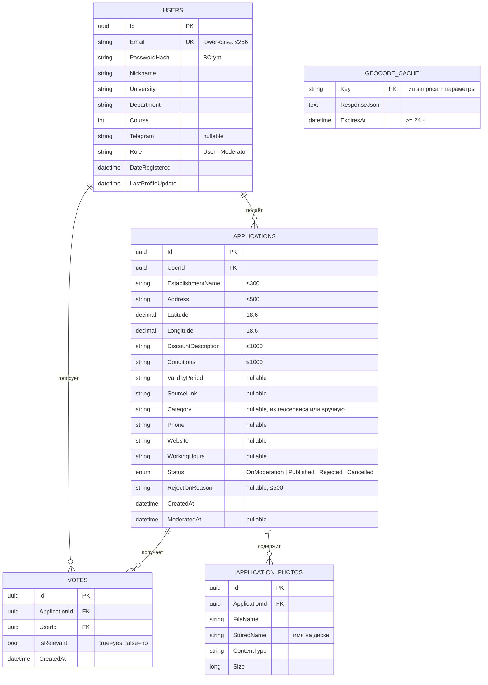
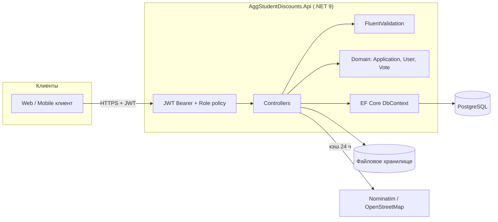

# 4. Диаграммы

Все диаграммы написаны в Mermaid и отображаются прямо в GitHub.

## 4.1 Процесс «Жизненный цикл скидки» (to-be, BPMN-подобная схема)

## 4.2 Диаграмма состояний заявки

## 4.3 Диаграмма последовательности: подача и модерация

## 4.4 Диаграмма последовательности: голосование

## 4.5 ER-диаграмма

## 4.6 Архитектура (C4, уровень контейнеров)

