# Техническое задание: веб-сервис «Агрегатор студенческих скидок»

# **ГЛОССАРИЙ**

| Термин | Определение |
| :---- | :---- |
| **Роли пользователей** |  |
| **Гость** | незарегистрированный посетитель Системы; имеет доступ только к просмотру опубликованных заведений и карты. |
| **Пользователь** | зарегистрированный участник Системы; вправе подавать заявки, голосовать за актуальность скидок. |
| **Модератор** | привилегированный участник Системы, наделённый правами проверки, утверждения и редактирования заявок, а также редактирования опубликованных заведений. |
| **Основные сущности** |  |
| **Система** | веб\-сервис «Агрегатор студенческих скидок» — совокупность программных компонентов, обеспечивающих сбор, хранение, модерацию и отображение сведений о студенческих скидках. |
| **Заведение** | организация или точка обслуживания (общественного питания), предоставляющая скидку студентам и зарегистрированная в Системе. |
| **Заявка** | запрос пользователя на добавление сведений о студенческой скидке в конкретном заведении; проходит процедуру модерации до публикации. |
| **Карточка заведения** | всплывающий элемент интерфейса, отображающий полную информацию о заведении: наименование, адрес, категорию, условия скидки, фотоматериалы и счётчик голосов актуальности. |
| **Медиафайл** | загружаемый пользователем файл изображения (фотография меню, буклета или рекламы), служащий подтверждением наличия студенческой скидки. |
| **Статусы заявок** |  |
| **На проверке** | статус заявки, поданной пользователем и ожидающей рассмотрения модератором. |
| **Опубликовано** | статус заявки, утверждённой модератором; заведение отображается на карте и в списке. |
| **Отклонено** | статус заявки, по которой модератором принято отрицательное решение; пользователю сообщается причина. |
| **Функциональные понятия** |  |
| **Модерация** | процедура проверки модератором поданной заявки с последующим принятием решения об утверждении, редактировании или отклонении. |
| **Аутентификация** | процедура проверки подлинности пользователя при входе в Систему посредством ввода email и пароля. |
| **Голосование за актуальность** | механизм краудсорсинговой проверки достоверности данных о скидке: авторизованный пользователь отвечает «Да» / «Нет» на вопрос о том, действует ли скидка. |
| **Краудсорсинг** | способ формирования и поддержания актуальности базы данных за счёт коллективного вклада пользователей. |
| **Автообогащение данных** | автоматическое дополнение заявки атрибутами заведения (категория, контакты, режим работы), получаемыми от внешних геоинформационных сервисов. |
| **Актуализация данных профиля** | автоматизированная процедура ежегодного уточнения курса обучения пользователя с запросом подтверждения в октябре. |
| **Пометка о неподтверждённых данных** | служебная отметка в профиле, устанавливаемая при отказе пользователя от актуализации данных. |
| **Технические понятия** |  |
| **Бэкенд** | серверная часть Системы, обеспечивающая обработку запросов, взаимодействие с базой данных и внешними геоинформационными сервисами. |
| **Фронтенд** | клиентская часть Системы, формирующая пользовательский интерфейс в браузере. |
| **СУБД** | система управления базами данных \- программное обеспечение для хранения и обработки данных Системы. |
| **Геоинформационный сервис** | внешний сервис, предоставляющий данные о географических объектах: координаты, адреса, атрибуты заведений. |
| **Геокодинг** | процесс преобразования текстового адреса или названия в географические координаты. |
| **Автоподсказки** | динамически формируемый список вариантов при вводе поискового запроса на основе данных геоинформационного сервиса. |
| **Тайл** | фрагмент картографического изображения, загружаемый браузером по мере перемещения карты. |
| **Шапка** | горизонтальная полоса в верхней части интерфейса, содержащая логотип, строку поиска и элементы навигации.  |
| **Индикатор статуса заявок** | цветная плашка с закруглёнными краями, отображающая текущий статус заявки («Опубликовано», «На проверке», «Отклонено»).  |
| **Выдвижная панель снизу** | элемент мобильного интерфейса, открывающийся снизу экрана поверх основного содержимого; используется для отображения карточки заведения.  |
| **Нижняя навигационная панель**  | фиксированная полоса в нижней части экрана мобильного устройства, обеспечивающая переход между основными разделами Системы.  |
| **Адаптивный интерфейс** | интерфейс, автоматически изменяющий компоновку элементов в зависимости от ширины экрана устройства.  |
| **Маркер** | графический элемент на карте, обозначающий местоположение заведения; при нажатии открывает карточку. |
| **Кэширование** | механизм временного хранения ранее полученных данных для сокращения повторных запросов к внешним сервисам. |
| **JSON** | текстовый формат обмена данными между серверной и клиентской частями Системы. |
| **HTML** | язык разметки для формирования страниц пользовательского интерфейса в браузере. |
| **Предметная область** |  |
| **Студенческая скидка** | форма льготного обслуживания, предоставляемая заведением лицам со статусом студента. |
| **Студенческий билет** | официальный документ, подтверждающий статус студента. |

 

# **1\. ВВЕДЕНИЕ**

Настоящее техническое задание разработано в соответствии с требованиями ГОСТ 19.201-78 и устанавливает совокупность требований к разработке веб\-сервиса «Агрегатор студенческих скидок».  
Документ предназначен для использования в качестве основания для проектирования, разработки, тестирования и ввода в эксплуатацию Системы.  
Разработка системы осуществляется в соответствии с принципами открытых геоданных и с использованием общедоступных API-интерфейсов без привлечения коммерческих картографических сервисов.

# **2\. КРАТКОЕ ОПИСАНИЕ ПРЕДМЕТНОЙ ОБЛАСТИ**

Студенческие скидки представляют собой форму льготного обслуживания, предоставляемого заведениями сферы общественного питания, торговли, культуры и иных услуг лицам, обладающим статусом студента и способным подтвердить его наличие соответствующим документом (студенческим билетом).  
Актуальной проблемой целевой аудитории является отсутствие единого агрегированного источника информации о действующих скидках в заведениях конкретного района или города. Сведения о скидках, как правило, распространяются стихийно — через социальные сети, мессенджеры и сарафанное радио, что существенно снижает их доступность и актуальность.  
Настоящая Система призвана устранить указанный информационный разрыв посредством создания централизованной платформы, обеспечивающей накопление, верификацию и публичное отображение сведений о студенческих скидках на интерактивной карте.

# **3\. ОСНОВАНИЯ ДЛЯ РАЗРАБОТКИ**

Разработка ведётся в рамках выполнения семестрового домашнего задания согласно учебному плану по дисциплине «Программная инженерия», утверждённого факультетом СГН3.

# **4\. ЦЕЛЬ СОЗДАНИЯ**

Система создаётся в целях решения следующих задач:

**4.1** Обеспечение студентам удобного инструмента для поиска актуальных скидок в заведениях г. Москвы без необходимости обращения к разрозненным источникам.

**4.2** Формирование краудсорсинговой базы данных студенческих скидок с верифицированным содержимым, исключающей публикацию непроверенных сведений.

**4.3** Снижение трудоёмкости ввода данных за счёт автоматического подтягивания базовой информации о заведении из открытых геоисточников.

**4.4** Обеспечение прозрачности процедуры добавления материалов: пользователь должен располагать возможностью отслеживания статуса поданной заявки на каждом этапе рассмотрения.

**4.5** Повышение достоверности публикуемых данных посредством загрузки подтверждающих материалов (фото) и краудсорсингового голосования за актуальность.

# **5\. ТРЕБОВАНИЯ К СИСТЕМЕ**

## **5.1 Основные требования**

— Система должна реализовываться в архитектуре «клиент \- сервер» с браузерным интерфейсом, не требующим установки дополнительного ПО на стороне клиента.

— Система должна обеспечивать одновременную работу не менее 100 пользователей без деградации производительности.

— Время отклика на типовые запросы не должно превышать 3 секунд при скорости соединения от 5 Мбит/с.

— Система должна функционировать в режиме 24/7; допустимое время плановых остановок не более 2 часов в месяц.

— Система должна корректно функционировать в актуальных версиях браузеров: Яндекс.Браузер 23+, Chrome 110+, Safari 15+.

— Интерфейс должен обеспечивать адаптивное отображение в диапазоне разрешений от 320 px до 2560 px. 

— Система должна реализовывать механизм защиты от злоупотреблений: не более 4 заявок в сутки от одного пользователя. Отменённые заявки учитываются в суточном лимите и не восстанавливают счётчик.

## **5.2 Требования к функциональным возможностям**

Система должна реализовывать следующий функционал:

**— А. Отображение данных —** список и интерактивная карта с маркерами опубликованных заведений; карточка заведения по клику на маркер.

**— Б. Поиск и фильтрация —** поиск по наименованию; фильтрация по району или радиусу от точки.

**— В. Добавление заявки —** форма ввода с автоподсказками; автообогащение данными из открытых геоисточников; загрузка фото подтверждения; отправка на модерацию. 

**— Г. Модерация —** очередь заявок; инструменты утверждения, отклонения и редактирования; редактирование опубликованных заведений.

**— Д. Личный кабинет —** приватный раздел пользователя: перечень поданных заявок с актуальными статусами и причинами отклонения.

**— Е. Голосование за актуальность —** мини-опрос «Скидка актуальна?» на карточке заведения; доступен всем авторизованным пользователям; результат отображается в виде счётчика голосов 	«Да» / «Нет» с датой последнего голосования под каждым вариантом ответа.

**— Ж. Регистрация и аутентификация —** регистрация и вход посредством email и пароля.

**— З. Актуализация данных профиля —** ежегодное автоматическое обновление курса обучения в октябре.

— **И. Обратная связь** — возможность пользователя связаться с администрацией сервиса через email; доступна в карточке заведения, шапке/футере сайта и личном кабинете рядом с отклонённой заявкой.

## **5.3 Требования по реализации**

### **5.3.1 Серверная часть (бэкенд)**

— Платформа: C\# / ASP.NET Core 9.0

— Взаимодействие с клиентом: RESTful API.

— Все обращения к внешним геоинформационным сервисам осуществляются исключительно на стороне сервера.

— Обязательное кэширование результатов геокодинга; минимальное время жизни кэша 24 часа.

— Серверная часть должна обеспечивать приём и хранение загружаемых пользователями медиафайлов (фото подтверждений скидки).

### **5.3.2 Клиентская часть (фронтенд)**

— Стек: React 18+ / TypeScript

— Тайлы картографической подложки загружаются динамически по мере прокрутки и масштабирования; ранее загруженные тайлы кэшируются на стороне браузера. 

— В качестве картографической подложки используются тайлы открытого картографического сервиса на безвозмездной основе.

### **5.3.3 База данных**

— Реляционная СУБД с поддержкой геопространственных расширений  
PostgreSQL с расширением PostGIS.

## **5.4 Роли в системе**

| Роль | Права доступа |
| :---- | :---- |
| Гость | Просмотр карты и карточек опубликованных заведений; голосование  недоступно |
| Пользователь | Права гостя \+ подача заявок \+ загрузка фото \+ голосование за актуальность \+ просмотр личного кабинета |
| Модератор | Права пользователя \+ рассмотрение заявок (утверждение / отклонение / редактирование) \+ редактирование опубликованных заведений. Без ограничений по суточному лимиту заявок и сроку повторного голосования  |
| Администратор | участник с полным доступом к Системе; осуществляет управление учётными записями, назначение ролей и настройку параметров Системы. |

Назначение роли модератора осуществляется администратором через прямой доступ к базе данных или консоли управления.

Интерфейс для роли администратор не предусмотрен, выполняет управление Системой через консоль и БД.

## **5.5 Пользовательские функциональные требования**

### **Регистрация и аутентификация**

— Система должна обеспечивать регистрацию посредством заполнения формы: email, пароль, имя/никнейм, ВУЗ, кафедра, курс, Telegram (опционально).

— Аккаунт активируется немедленно после успешного заполнения формы без дополнительного подтверждения.

— Повторная регистрация с уже существующим email не допускается; Система выводит соответствующее уведомление.

— Восстановление пароля осуществляется путём обращения пользователя в техническую поддержку.

### **Просмотр карты**

— Отображение маркеров заведений со статусом «опубликовано» в пределах выбранного района г. Москвы.

— При активации маркера — отображение карточки: наименование, адрес, категория, скидка, условия, период действия, счётчик голосов актуальности, дата последних голосов «Да» / «Нет» , фото (при наличии).

— Список и карта представляют собой два равноправных режима отображения с возможностью переключения.

— На карточке каждого опубликованного заведения должна быть расположена кнопка «Сообщить о проблеме»; при нажатии пользователю предоставляется выбор способа связи: написать в Telegram или на email администрации сервиса.

### **Просмотр списка**

— Карточный или табличный перечень заведений с поиском по наименованию и сортировкой.

— В карточном представлении каждого заведения должна отображаться кнопка «Сообщить о проблеме» аналогично карточке на карте.

— В карточном или табличном представлении под наименованием каждого заведения должен отображаться его адрес.

### **Добавление заявки**

— Ввод адреса/названия → автоподсказки → выбор объекта → фиксация координат и адреса.

— При отсутствии заведения в поиске \- постановка точки на карте \+ ручной ввод названия и адреса.

— Обязательные поля: скидка, условия, фото подтверждения. Опциональные: срок действия, ссылка на источник.

— При загрузке фото Система ожидает формат: JPEG, HEIC, PDF, PNG.

— Серверная часть автоматически обогащает заявку атрибутами объекта из открытых геоисточников.

— Система ограничивает количество заявок от одного пользователя не более чем 4 в сутки. Отменённые заявки учитываются в лимите. Ограничение распространяется на роль Пользователь. На роль Модератор ограничение не распространяется. 

— Пользователь вправе отменить поданную заявку до момента её рассмотрения модератором (статус «на проверке»). После перевода в статус «опубликовано» или «отклонено» отмена недоступна.

— В списке автоподсказок под каждым предложенным наименованием заведения должен отображаться его адрес.

### **Личный кабинет**

— Перечень заявок пользователя с отображением статуса каждой.

— При статусе «отклонено» — отображение причины, указанной модератором.

— Пользователь вправе отменить заявку со статусом «на проверке» непосредственно из личного кабинета.

— Рядом с каждой заявкой со статусом «отклонено» должна отображаться кнопка «Связаться с модератором» с выбором способа: Telegram или email.

### **Голосование за актуальность скидки**

— На карточке каждого опубликованного заведения расположен мини-опрос «Скидка актуальна?» с вариантами «Да» / «Нет».

— Голосование доступно всем авторизованным пользователям; повторное голосование по одному заведению не ранее чем через 15 дней. Ограничение распространяется на роль Пользователь. На роль Модератор ограничение не распространяется.

— Результат отображается в виде агрегированного счётчика голосов.

— Под кнопками отображается дата последнего голосования.

— Гость, нажавший кнопку голосования, получает предложение войти или зарегистрироваться.

### **Актуализация данных профиля**

— Ежегодно в октябре Система обновляет данные пользователя: увеличивает курс обучения на 1\.

**Обратная связь:**

> — Кнопка обратной связи должна быть постоянно доступна в шапке и футере сайта для всех пользователей включая гостей  
>  — При нажатии пользователю отображается выбор: написать в Telegram (ссылка на аккаунт/группу) или на email (ссылка mailto).  
> — Конкретные адреса Telegram и email администрации задаются в настройках Системы и подлежат определению на этапе проектирования.

### **Панель модератора**

— Очередь заявок «на проверке» с фильтрацией.

— Карточка заявки: карта с маркером, адрес, координаты, скидка, условия, загруженные фото, данные из открытых геоисточников.

— Операции по заявке: утвердить (публикация) / отклонить (с обязательным указанием причины) / редактировать содержимое до утверждения.

— Редактирование опубликованных заведений: корректировка названия, адреса, данных о скидке, условиях, сроке действия.

## **5.6 Входные параметры системы**

| № | Контекст / Источник | Параметр | Обязательность |
| :---- | :---- | :---- | :---- |
| 1 | Регистрация | Email | Да |
| 2 | Регистрация | Пароль | Да |
| 3 | Регистрация | Имя / никнейм | Да |
| 4 | Регистрация | Наименование ВУЗа | Да |
| 5 | Регистрация | Кафедра | Да |
| 6 | Регистрация | Курс обучения | Да |
| 7 | Регистрация | Telegram-аккаунт | Нет |
| 8 | Вход | Email \+ пароль | Да |
| 9 | Заявка на скидку | Поисковый запрос (адрес / название) | Да (или п. 10\) |
| 10 | Заявка на скидку | Координаты точки на карте | Альтернатива п. 9 |
| 11 | Заявка на скидку | Размер / описание скидки | Да |
| 12 | Заявка на скидку | Условия получения скидки | Да |
| 13 | Заявка на скидку | Срок действия скидки | Нет |
| 14 | Заявка на скидку | Фото подтверждения (меню, буклет, реклама) | Да |
| 15 | Заявка на скидку | Ссылка на источник | Нет |
| 16 | Голосование | Голос в мини-опросе актуальности | Нет |
| 17 | Геоинформационный сервис (авто) | Координаты, адрес, наименование | Авто |
| 18 | Геоинформационный сервис (авто) | Категория, телефон, сайт, режим работы | Авто |
| 19 | Модератор | Решение по заявке (утвердить / отклонить) | Да (при модерации) |
| 20 | Модератор | Причина отклонения | Да (при отклонении) |
| 21 | Пользователь  | Выбор способа обратной связи (Telegram/email) | Нет |

## **5.7 Выходные параметры системы**

Все выходные данные Системы представляются пользователю в виде HTML-страниц, отображаемых в браузере. Передача данных между сервером и клиентом осуществляется в формате JSON; клиентская часть преобразует полученные данные в элементы пользовательского интерфейса.

| № | Получатель | Выходной параметр |
| :---- | :---- | :---- |
| 1 | Все пользователи | Перечень опубликованных заведений с координатами → маркеры на карте |
| 2 | Все пользователи | Карточка заведения |
| 3 | Все пользователи | Результаты поиска по наименованию |
| 4 | Все пользователи | Автоподсказки адресов |
| 5 | Пользователь (авторизованный) | Список заявок и их статусы (личный кабинет) |
| 6 | Пользователь (авторизованный) | Уведомление об изменении статуса заявки |
| 7 | Пользователь (авторизованный) | Всплывающее уведомление актуализации курса (октябрь) |
| 8 | Модератор | Очередь заявок на модерацию |
| 9 | Модератор | Полная карточка заявки с геоданными и медиафайлами |

## **5.8 Информация, содержащаяся в базе данных**

База данных Системы должна содержать следующие группы данных:

 **Данные о пользователях —** регистрационные сведения (электронная почта, пароль), личные данные профиля (имя/никнейм, ВУЗ, кафедра, курс, Telegram), роль, дата регистрации, статус учётной записи.

**Данные о заявках —** наименование заведения, адрес, координаты, описание скидки, условия получения скидки, срок действия, ссылка на источник, прикреплённые фотоматериалы, данные из открытых геоисточников (категория, контакты, режим работы), статус заявки, причина отклонения

**Данные об опубликованных заведениях —** итоговые сведения о заведении после прохождения модерации: наименование, адрес, координаты, категория, контактные данные, режим работы, условия скидки, прикреплённые фотоматериалы, дата публикации, текущий статус записи.

**Данные о голосованиях —** сведения об оценках актуальности скидок: привязка к заведению, автор голоса, значение (актуально / неактуально), дата голосования.

**Кэш геоинформационных запросов —** временно хранимые результаты обращений к внешним сервисам; каждая запись содержит параметры запроса, полученный результат и срок актуальности (не менее 24 часов).

# **6\. ТРЕБОВАНИЯ К ДИЗАЙНУ**

Настоящий раздел устанавливает требования к визуальному оформлению интерфейса Системы. Макеты экранов приведены в Приложениях 1–7.

## **6.1. Цветовая палитра**

—	**Основные цвета:** белый (\#FFFFFF) и светло-бежевый (\#F5F3EE) — фон страниц и карточек; тёмно-серый (\#1A1A1A) — основной текст.

—	**Акцентный цвет:** синий (\#2563EB) — основные кнопки (регистрация, добавление, далее), активные состояния переключателей, ссылки, плавающая кнопка «+».

—	**Семантические цвета статусов:** зелёный (\#22C55E) — «Опубликовано»; жёлто-оранжевый (\#F59E0B) — «На проверке»; красный (\#EF4444) — «Отклонено», сообщения об ошибках.

—	**Цвета маркеров на карте:** синий (\#2563EB) — заведения категории «Общепит»; тёмно-зелёный (\#3D6B4F) — прочие категории.

## **6.2. Типографика**

В интерфейсе применяется системный шрифт без засечек (sans-serif): Inter, Segoe UI, Roboto, Helvetica Neue. Размерная шкала:

—    основной текст — 14–16 px;

—	вторичные подписи (адрес, статус) — 12–13 px;

—	заголовки карточек и разделов — 18–20 px;

—	заголовки страниц («Регистрация», «Мои заявки») — 22–24 px.

## **6.3. Компоненты интерфейса**

—    **Шапка (Header).** Горизонтальная полоса с логотипом «СтудСкидки» и синей иконкой-кружком слева, строкой поиска с иконкой лупы по центру, блоком «Войти / Регистрация» справа. После авторизации вместо кнопок отображается имя пользователя. На мобильных кнопки скрываются за иконкой меню (см. Приложение 1).

—    **Карточка заведения в списке.** Прямоугольная карточка с белым фоном и лёгкой тенью; содержит: наименование полужирным, адрес серым текстом, бейдж скидки (например «–15%») на зелёном фоне, ссылку «Сообщить о проблеме». Выбранная карточка выделяется синей обводкой (см. Приложения 1, 2).

—    **Детальная карточка заведения.** На компьютере открывается в виде панели поверх карты справа. На мобильном — в виде нижнего листа. Содержит: наименование, адрес, категорию, срок действия, описание условий скидки, блок голосования «Скидка актуальна?» с кнопками «Да» / «Нет», счётчиками голосов и датами последних голосований, кнопку «Сообщить о проблеме» (см. Приложение 2).

—    **Переключатель режимов «Список / Карта».** На компьютере – вкладки, активная выделена синей подчёркивающей линией. На мобильном – два полноширинных переключателя; активный режим отображается синим фоном (см. Приложение 1).

—    **Кнопки.** В интерфейсе используется три вида кнопок. Кнопка основного действия (например, «Зарегистрироваться», «Отправить на модерацию», «Войти») – синяя, растянута на всю ширину формы. Кнопка второстепенного действия (например, «Редактировать») – белая с серой рамкой. Кнопка опасного действия (например, «Отклонить» в панели модератора) — красная. 

—    **Поля ввода.** Белый фон, светло-серая обводка; при фокусе обводка сменяется на синюю. Обязательные поля отмечаются символом «\*». Ошибки валидации выводятся красным текстом под полем (см. Приложения 3, 5).

—   **Индикаторы статуса заявки.** Статус каждой заявки отображается в виде небольшой цветной плашки с закруглёнными краями и текстом внутри: зелёная – «Опубликовано», жёлтая – «На проверке», красная – «Отклонено». Такие плашки видны в таблице личного кабинета. (см. Приложения 6). 

—    **Нижняя навигационная панель (только на мобильном).** Фиксированная полоса с тремя зонами: «Главная», центральная кнопка «+» (синяя, круглая, слегка приподнята над панелью), «Кабинет». Активный пункт подчеркивается горизонтальным штрихом (см. Приложение 1).

## **6.4. Структура экранов**

—    **Экран 1\.  Главный экран (Приложение 1).** Двухколоночная компоновка: левая колонка – строка поиска, фильтр «Район», переключатель режимов, прокручиваемый список карточек заведений; правая колонка – интерактивная карта. Кнопка «+ Добавить заведение» фиксирована в правом нижнем углу карты.

—	**Экран 2\. Карточка заведения (Приложение 2).** На компьютере карточка открывается в виде боковой панели поверх карты справа (около 50% ширины экрана). На мобильном устройстве – в виде выдвижной панели снизу с возможностью перетаскивания по вертикали. Карточка содержит: наименование, адрес, срок действия скидки, описание условий, блок голосования «Скидка актуальна?», кнопку «Сообщить о проблеме».

—    **Экран 3\. Регистрация (Приложение 3).** На компьютере – центральная карточка шириной 480 px. На мобильном устройстве – полноэкранная страница с прокруткой. Форма включает поля: Email, Пароль, Имя/никнейм, ВУЗ, Кафедра, Курс, Telegram (необязательно), кнопку «Зарегистрироваться», ссылку «Уже есть аккаунт? Войти».

—    **Экран 4\. Вход в систему (Приложение 4).** Аналогичен экрану регистрации; форма включает поля Email, Пароль, кнопку «Войти», ссылку «Нет аккаунта? Зарегистрироваться».

—	**Экран 5\.  Добавление заявки (Приложение 5).** На компьютере – двухколоночная компоновка: левая колонка – форма (поиск заведения, скидка, условия получения, срок действия, ссылка на источник, загрузка фото, счётчик оставшихся заявок на сутки), правая колонка – интерактивная карта с маркером найденного заведения. На мобильном устройстве — пошаговая форма из двух шагов: шаг 1 – поиск заведения, шаг 2 – сведения о скидке.

—	**Экран 6\. Личный кабинет (Приложение 6).** На компьютере – боковое меню (пункты: «Мои заявки», «Обратная связь») и таблица заявок с фильтрами по статусу. На мобильном устройстве — карточки заявок с горизонтальной прокруткой фильтров по статусу.

—	**Экран 7\.  Панель модератора (Приложение 7).** Только для компьютера. Три зоны: навигационное меню, очередь заявок с фильтром, карточка выбранной заявки (карта с маркером, сведения о заявке, фотоматериалы, поле причины отклонения, кнопки «Утвердить» / «Редактировать» / «Отклонить»).

## **6.5. Адаптивность**

Интерфейс реализуется в двух контрольных точках:

— **Компьютер от 1024 px (эталон 1440 px):** двухколоночная компоновка; карточка заведения открывается в виде боковой панели поверх карты справа; личный кабинет — боковое меню и таблица заявок; форма добавления заявки — форма слева, карта справа.

— **Мобильное устройство до 1023 px (эталон 390 px):** одноколоночная компоновка; все элементы растягиваются на полную ширину экрана.

Особенности мобильного отображения:

— **Выдвижная панель снизу.** Карточка заведения открывается снизу поверх карты и занимает примерно 60–70% высоты экрана. Поддерживает перетаскивание по вертикали, вверху панели расположена горизонтальная полоска-индикатор. Карта при этом остаётся частично видна сверху.

— **Нижняя навигационная панель.** Фиксированная полоса высотой \~56 px в нижней части экрана. Три зоны: «Главная» слева, центральная кнопка «+» для быстрого добавления заявки (синяя, круглая, диаметр \~52 px, приподнята над панелью), «Кабинет» справа. Активный пункт подчёркивается горизонтальным штрихом над подписью. 

— **Пошаговая форма добавления заявки.** Вместо одноэкранной формы применяется разбивка на два шага с индикатором прогресса вверху: шаг 1 — поиск заведения (поле ввода с автоподсказками и карта с маркером); шаг 2 — сведения о скидке (поля: скидка, условия, срок действия, ссылка, загрузка фото, счётчик заявок, кнопка «Отправить на модерацию»). Переход между шагами — кнопка «Далее».

— **Личный кабинет.** Боковое меню заменяется горизонтальной прокруткой фильтров («Все», «На проверке», «Опубликовано», «Отклонено»). Заявки отображаются карточками в одну колонку с наименованием, адресом, индикатором статуса, датой и доступными действиями.

— **Строка поиска и фильтр.** Расположены над переключателем «Карта / Список» и занимают полную ширину экрана.

# **7\. СЦЕНАРИИ ФУНКЦИОНИРОВАНИЯ СИСТЕМЫ**

Настоящий раздел описывает типовые сценарии взаимодействия пользователей с Системой в формате последовательности действий участника и реакций Системы, включая основные и альтернативные пути выполнения.

## **Сценарий 1\. Регистрация и вход в систему**

**Действующее лицо:** незарегистрированный посетитель

**1.1. Пользователь:** открывает сайт и нажимает «Зарегистрироваться».

*→ Система отображает форму регистрации: email, пароль, имя/никнейм, ВУЗ, кафедра, курс, Telegram.*

**1.2. Пользователь:** заполняет форму и нажимает «Создать аккаунт».

*→ Система проверяет уникальность email. Если занят — выводит уведомление. Если свободен — создаёт аккаунт, выполняет вход, открывает главный экран.*

**1.3. Пользователь:** (при повторном визите) вводит email и пароль, нажимает «Войти».

*→ Система проверяет данные. При успехе — открывает главный экран. При ошибке — выводит уведомление.*

## **Сценарий 2\. Поиск заведения на карте и в списке**

**Действующее лицо:** любой посетитель

### **Основной путь — просмотр карты**

**2.1. Пользователь:** открывает главный экран.

*→ Система отображает интерактивную карту г. Москвы с маркерами опубликованных заведений.*

**2.2. Пользователь:** перемещает карту или изменяет масштаб.

*→ Система динамически подгружает тайлы и маркеры для новой области. Ранее загруженные тайлы берутся из кэша браузера.*

**2.3. Пользователь:** нажимает на маркер заведения.

*→ Система отображает карточку: наименование, адрес, категория, скидка, условия, срок действия, счётчик голосов, дата последних голосов «Да» / «Нет», фото (при наличии), кнопка «Сообщить о проблеме».*

### **Альтернативный путь — просмотр списком и поиск**

**2.4. Пользователь:** переключается в режим списка.

*→ Система отображает перечень опубликованных заведений.*

**2.5. Пользователь:** вводит название в строку поиска.

*→ Система фильтрует результаты в режиме реального времени.*

**2.6. Пользователь:** применяет фильтр по району или радиусу.

*→ Система обновляет отображение в пределах заданной области.*

### **Альтернативный путь — нет результатов**

**2.7. Пользователь:** выполняет поиск, по которому заведений нет.

*→ Система отображает сообщение «Заведений не найдено» и предлагает расширить область или добавить заведение.*

## **Сценарий 3\. Добавление заявки на публикацию скидки**

**Действующее лицо:** авторизованный пользователь.

### **Основной путь — заведение найдено через поиск**

**3.1. Пользователь:** нажимает «Добавить заведение».

*→ Система отображает форму добавления заявки.*

**3.2. Пользователь:** вводит название или адрес в поисковую строку.

*→ Система отображает список автоподсказок; под каждым предложенным наименованием отображается адрес заведения.*

**3.3. Пользователь:** выбирает заведение из подсказок.

*→ Система фиксирует координаты и адрес; запрашивает у геоинформационного сервиса атрибуты объекта (категория, контакты, режим работы) и при наличии подставляет их в форму.*

**3.4. Пользователь:** заполняет обязательные поля (скидка, условия); прикладывает фото подтверждения, срок действия, ссылку.

*→ Система валидирует обязательные поля.*

**3.5. Пользователь:** нажимает «Отправить на проверку».

*→ Система присваивает заявке статус «на проверке» и помещает в очередь модерации. В личном кабинете появляется новая запись.*

### **Альтернативный путь — заведение не найдено**

**3.6. Пользователь:** ставит точку на карте вручную, вводит название и адрес.

*→ Система фиксирует координаты и продолжает сценарий с шага 3.4.*

### **Альтернативный путь — пользователь не авторизован**

**3.7. Гость:** нажимает «Добавить заведение».

*→ Система отображает предложение войти или зарегистрироваться.*

### **Альтернативный путь — отмена заявки**

**3.8. Пользователь:** открывает личный кабинет и нажимает «Отменить» напротив заявки со статусом «на проверке».

*→ Система снимает заявку с модерации и скрывает её из списка заявок пользователя; отменённая заявка учитывается в суточном лимите.*

## **Сценарий 4\. Модерация заявки**

**Действующее лицо:** модератор.

### **Основной путь — утверждение заявки**

**4.1. Модератор:** открывает панель модерации.

*→ Система отображает очередь заявок со статусом «на проверке».*

**4.2. Модератор:** открывает карточку заявки.

*→ Система отображает: карту с маркером, адрес, координаты, данные о скидке, фото, данные из открытых геоисточников.*

**4.3. Модератор:** проверяет данные и нажимает «Утвердить».

*→ Система публикует заведение — оно появляется на карте и в списке. Пользователю-автору направляется уведомление.*

### **Альтернативный путь — отклонение**

**4.4. Модератор:** нажимает «Отклонить» и вводит причину.

*→ Система присваивает статус «отклонено». Пользователю направляется уведомление с причиной.*

### **Альтернативный путь — редактирование перед утверждением**

**4.5. Модератор:** исправляет текст скидки или условий, затем нажимает «Утвердить».

*→ Система публикует заведение с исправленными данными.*

### **Альтернативный путь — редактирование опубликованного заведения**

**4.6. Модератор:** открывает карточку опубликованного заведения и вносит правки.

*→ Система сохраняет изменения; обновлённые данные немедленно отображаются на карте и в списке.*

## **Сценарий 5\. Голосование за актуальность скидки**

**Действующее лицо:** любой посетитель.

### **Основной путь**

**5.1. Пользователь:** открывает карточку заведения.

*→ Система отображает мини-опрос «Скидка актуальна?» с вариантами «Да» / «Нет» и счётчиком голосов и датой последнего голосования каждого «Да” / “Нет».*

**5.2. Пользователь:** нажимает «Да» или «Нет».

*→ Система фиксирует голос, обновляет счётчик и дату. Повторное голосование доступно не ранее чем через 15 дней.*

### **Альтернативный путь — повторное голосование раньше срока**

**5.3. Пользователь:** пытается проголосовать повторно раньше срока.

*→ Система отображает уведомление: «Повторное голосование будет доступно через 15 дней».*

### **Альтернативный путь — гость**

**5.4. Гость:** нажимает кнопку голосования.

*→ Система отображает предложение войти или зарегистрироваться для участия в голосовании.*

## **Сценарий 6\. Просмотр личного кабинета и статусов заявок**

**Действующее лицо:** авторизованный пользователь.

**6.1. Пользователь:** открывает раздел «Личный кабинет».

*→ Система отображает перечень всех заявок с текущим статусом каждой (на проверке / опубликовано / отклонено).*

**6.2. Пользователь:** нажимает на заявку со статусом «отклонено».

*→ Система отображает карточку заявки с причиной отклонения.*

**6.3. Пользователь:** нажимает на заявку со статусом «опубликовано».

*→ Система открывает карточку заведения на карте.*

## **Сценарий 7\. Обратная связь**	

**Действующее лицо:** любой посетитель.

**7.1. Пользователь:** открывает карточку заведения и нажимает «Сообщить о проблеме».

*→ Система отображает выбор способа связи: «Написать в Telegram» / «Написать на email»*

**7.2. Пользователь:** выбирает способ связи.

*→ Система открывает соответствующее приложение (Telegram или почтовый клиент) с предзаполненным получателем \- контактами администрации сервиса.*

### **Альтернативный путь — через шапку или футер сайта**

**7.3. Пользователь:** нажимает кнопку обратной связи в шапке или футере.

*→ Система отображает выбор: «Написать в Telegram» / «Написать на email».*

**7.4. Пользователь:** выбирает способ связи.

*→ Система открывает соответствующее приложение (Telegram или почтовый клиент) с предзаполненным получателем \- контактами администрации сервиса.*

### **Альтернативный путь — через личный кабинет:**

**7.5. Пользователь:** нажимает «Обратиться в поддержку» рядом с заявкой со статусом «отклонено».

*→ Система отображает выбор способа связи; в предзаполненном сообщении указывается номер отклонённой заявки для контекста.*

## **8\. ТРЕБОВАНИЯ К НАДЁЖНОСТИ**

**8.1 Доступность**

* Система должна функционировать в режиме 24/7; допустимое время плановых остановок не более 2 часов в месяц.  
* Плановые технические работы должны проводиться в период минимальной пользовательской активности.  
* Серверное оборудование должно быть подключено через источник бесперебойного питания (ИБП), обеспечивающий корректное завершение работы при отключении электроснабжения.  
* Сетевые фильтры должны применяться для защиты оборудования от бросков и помех в электрической сети.

**8.2 Сохранность данных**

* Система должна обеспечивать резервное копирование базы данных не реже одного раза в сутки.  
* Резервные копии должны храниться не менее 30 дней.  
* Загруженные пользователями медиафайлы должны включаться в резервное копирование.

**8.3 Устойчивость к отказам внешних сервисов**

* При временной недоступности внешних геоинформационных сервисов Система должна использовать кэшированные данные и продолжать отображение ранее загруженной информации.  
* При недоступности геоинформационного сервиса в момент подачи заявки Система должна уведомить пользователя и предложить ввести данные вручную.

**8.4 Целостность данных**

* Производить тестирование целостности данных методом PostgreSQL раз в месяц.  
* Ограничения (лимит заявок, периодичность голосования) должны проверяться на уровне базы данных, а не только на уровне интерфейса.

**8.5 Безопасность**

* Пароли пользователей должны храниться исключительно в виде хэша.  
* Взаимодействие между клиентом и сервером должно осуществляться по протоколу HTTPS.  
* Загружаемые файлы должны проходить проверку типа и размера на стороне сервера; допустимые форматы — JPEG, PNG, HEIC, PDF

Приложение 1

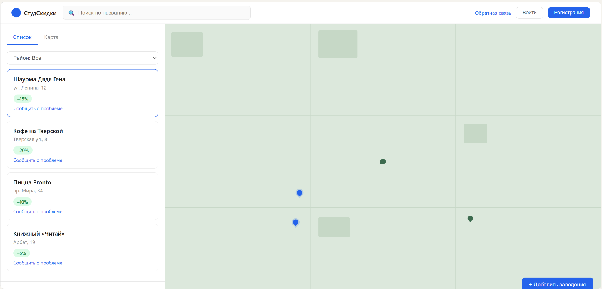

Приложение 2

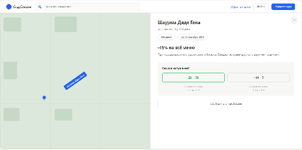

Приложение 3

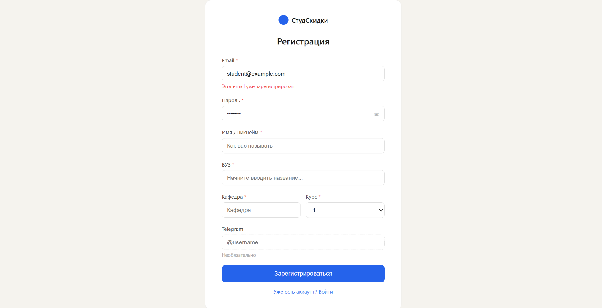

Приложение 4

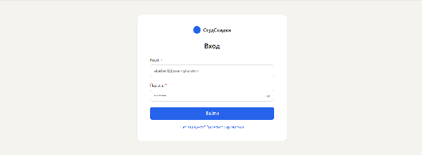

Приложение 5

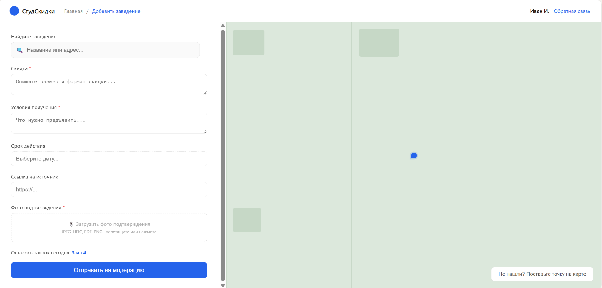

Приложение 6

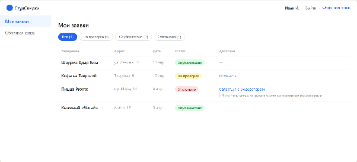

Приложение 7

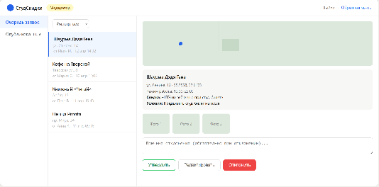

Use case диаграмма

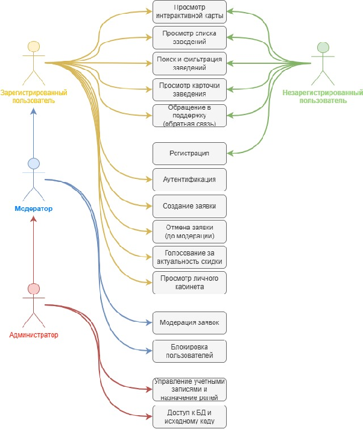

	ER-диаграмма для пользователя

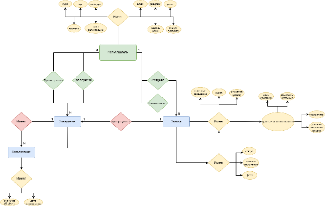

ER-диаграмма для модератора

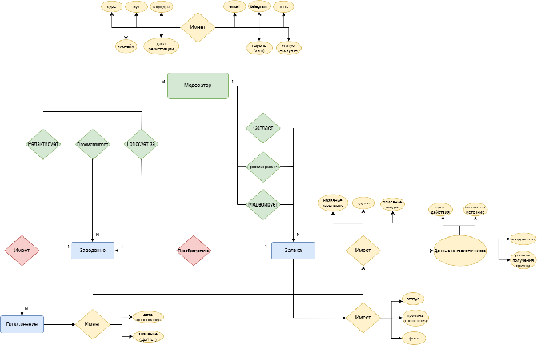

DF-диаграмма для гостя

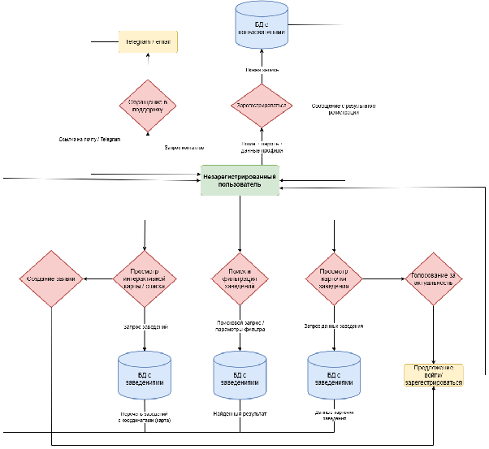

DF-диаграмма для пользователя

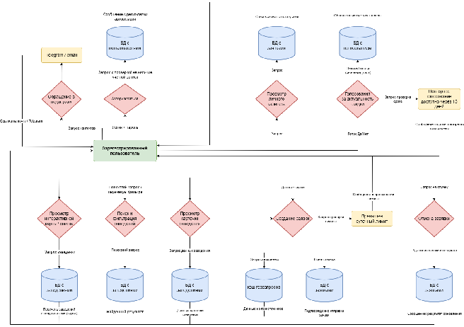

DF-диаграмма для модератора

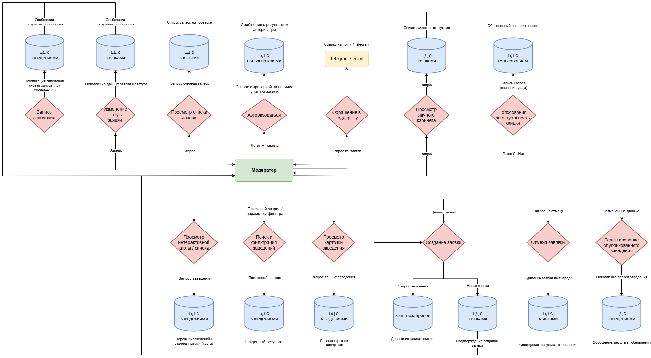

